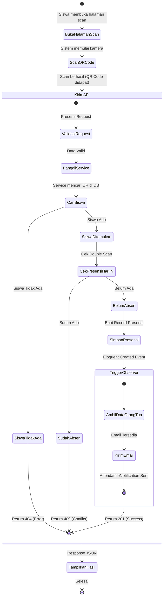

# Activity Diagram

## Aktivitas Utama Presensi QR Code

### Narasi Aktivitas (Versi Tekstual)
1.  **Awal**: Siswa membuka aplikasi di perangkat mobile (PWA).
2.  **Scan**: Kamera aktif, siswa mengarahkan ke QR Code.
3.  **Request**: Frontend mengekstrak payload QR dan mengirim `POST` ke `/api/presensi`.
4.  **Validasi**:
    *   Sistem mencari record siswa. Jika tidak ada -> Error 404.
    *   Sistem mengecek tabel presensi hari ini. Jika sudah ada -> Error 409.
5.  **Penyimpanan**: Jika lolos validasi, record presensi baru disimpan (ID siswa, tanggal, waktu, status).
6.  **Notifikasi**: `PresensiObserver` secara otomatis mendeteksi record baru dan mengirim email ke orang tua via SMTP.
7.  **Selesai**: Frontend menampilkan respon sukses ke siswa.
