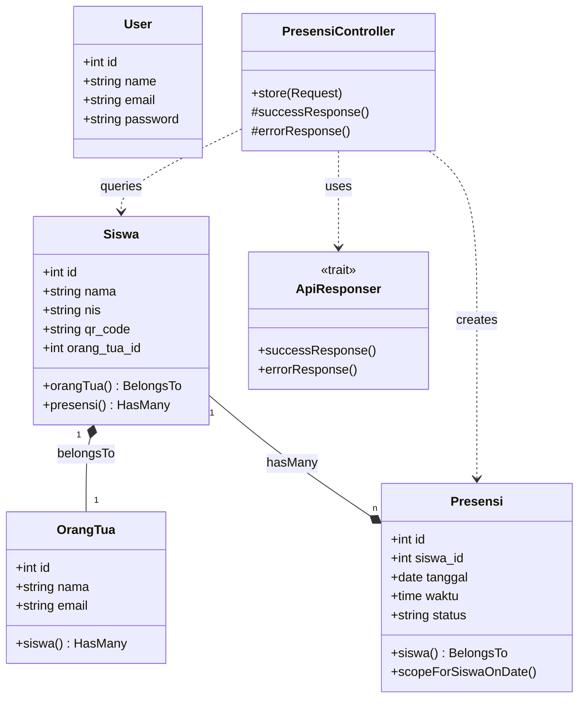

# Class Diagram

## Struktur Kelas Sistem PresensiGo

### Struktur Detail Kelas (Versi Tekstual)
- **Model: Siswa**
    - Atribut: `id`, `nama`, `nis`, `qr_code`, `orang_tua_id`
    - Relasi: `belongsTo(OrangTua)`, `hasMany(Presensi)`
    - Event: `booted()` -> Otomatis generate `qr_code` saat create.
- **Model: OrangTua**
    - Atribut: `id`, `nama`, `email`
    - Relasi: `hasMany(Siswa)`
- **Model: Presensi**
    - Atribut: `id`, `siswa_id`, `tanggal`, `waktu`, `status`
    - Relasi: `belongsTo(Siswa)`
- **Controller: PresensiController**
    - Method: `store(Request)` -> Validasi, Simpan, dan Kirim Email.
    - Trait: `ApiResponser` -> Standarisasi JSON.
