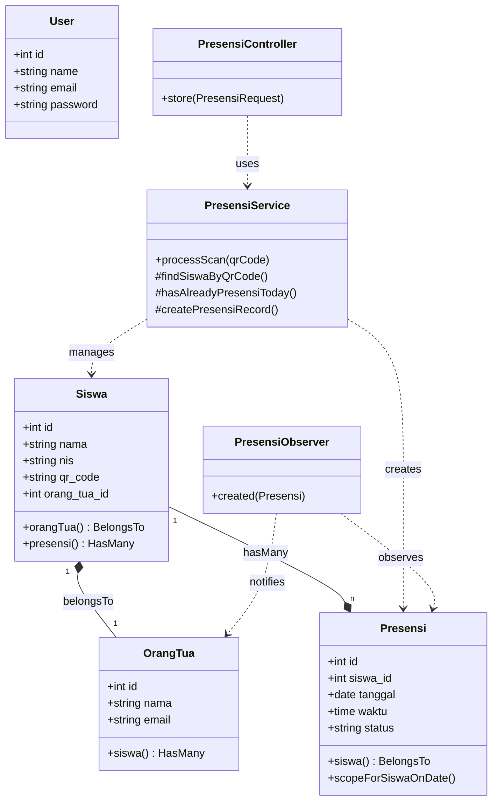

# Class Diagram

## Struktur Kelas Sistem PresensiGo

### Struktur Detail Kelas (Versi Tekstual)
- **Model: Siswa**
    - Atribut: `id`, `nama`, `nis`, `qr_code`, `orang_tua_id`
    - Relasi: `belongsTo(OrangTua)`, `hasMany(Presensi)`
- **Model: OrangTua**
    - Atribut: `id`, `nama`, `email`
    - Relasi: `hasMany(Siswa)`
- **Model: Presensi**
    - Atribut: `id`, `siswa_id`, `tanggal`, `waktu`, `status`
    - Relasi: `belongsTo(Siswa)`
- **Service: PresensiService**
    - Metode Utama: `processScan(qrCode)` -> Mengembalikan array response.
- **Observer: PresensiObserver**
    - Trigger: `created(Presensi)` -> Mengirim email.
