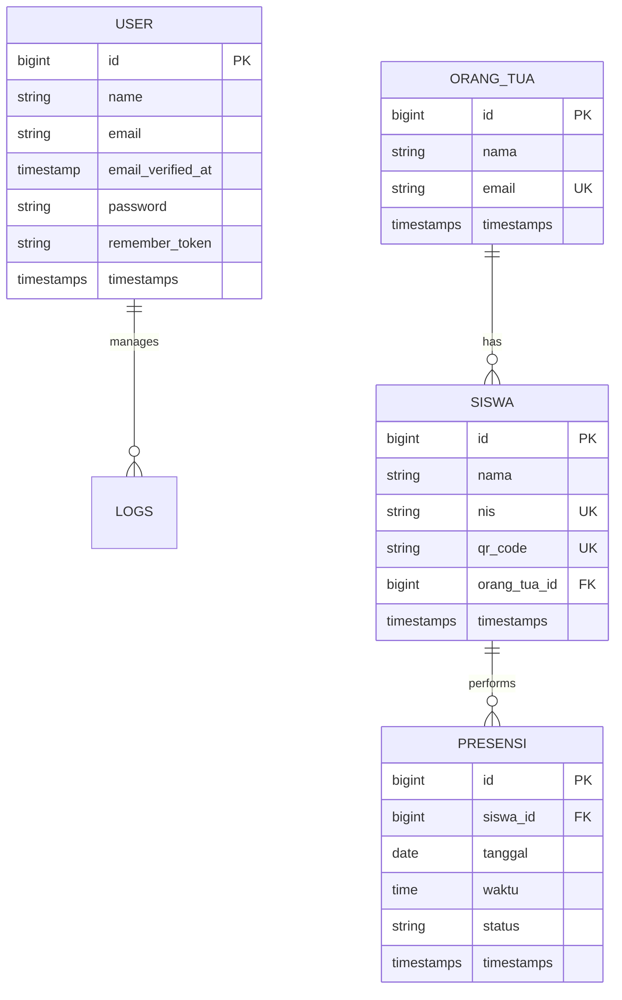

# Entity Relational Diagram (ERD)

Diagram ini menggambarkan hubungan antar entitas data dalam sistem PresensiGo.

## Deskripsi Hubungan:
1.  **Orang Tua ke Siswa**: Hubungan *One-to-Many*. Satu orang tua dapat memiliki lebih dari satu siswa yang terdaftar di sistem.
2.  **Siswa ke Presensi**: Hubungan *One-to-Many*. Satu siswa akan memiliki banyak catatan presensi seiring berjalannya waktu.
3.  **User (Admin)**: Bertindak sebagai pengelola seluruh data master (Siswa & Orang Tua) serta memantau log presensi.
