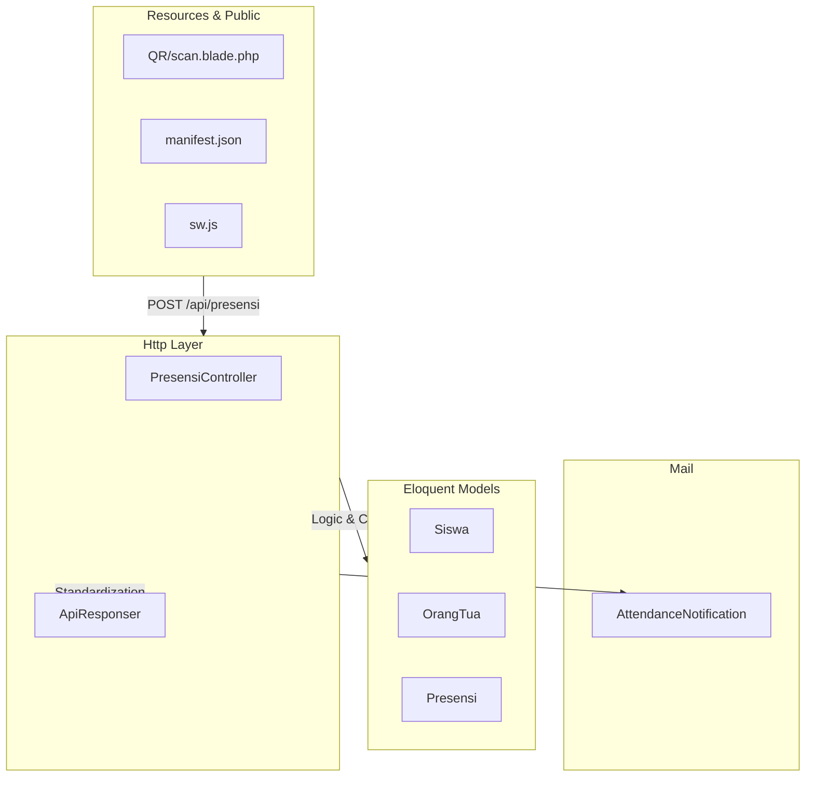

# Package Diagram

## Arsitektur Paket PresensiGo

### Daftar Komponen & Dependensi (Versi Tekstual)

- **Frontend (PWA)**:
    - `QR Scanner (Blade)` -> Entry point utama pemindaian.
    - `sw.js` -> Service worker untuk dukungan offline.
- **Backend (HTTP Layer)**:
    - `PresensiController` -> Menangani request, validasi, dan alur data utama (KISS).
    - `ApiResponser` -> Trait untuk standarisasi format output JSON.
- **Data (Eloquent Models)**:
    - `Siswa`, `OrangTua`, `Presensi`, `User`.
- **Side Effects (Mail)**:
    - `AttendanceNotification` -> Email yang dikirim langsung dari Controller setelah presensi berhasil dicatat.
