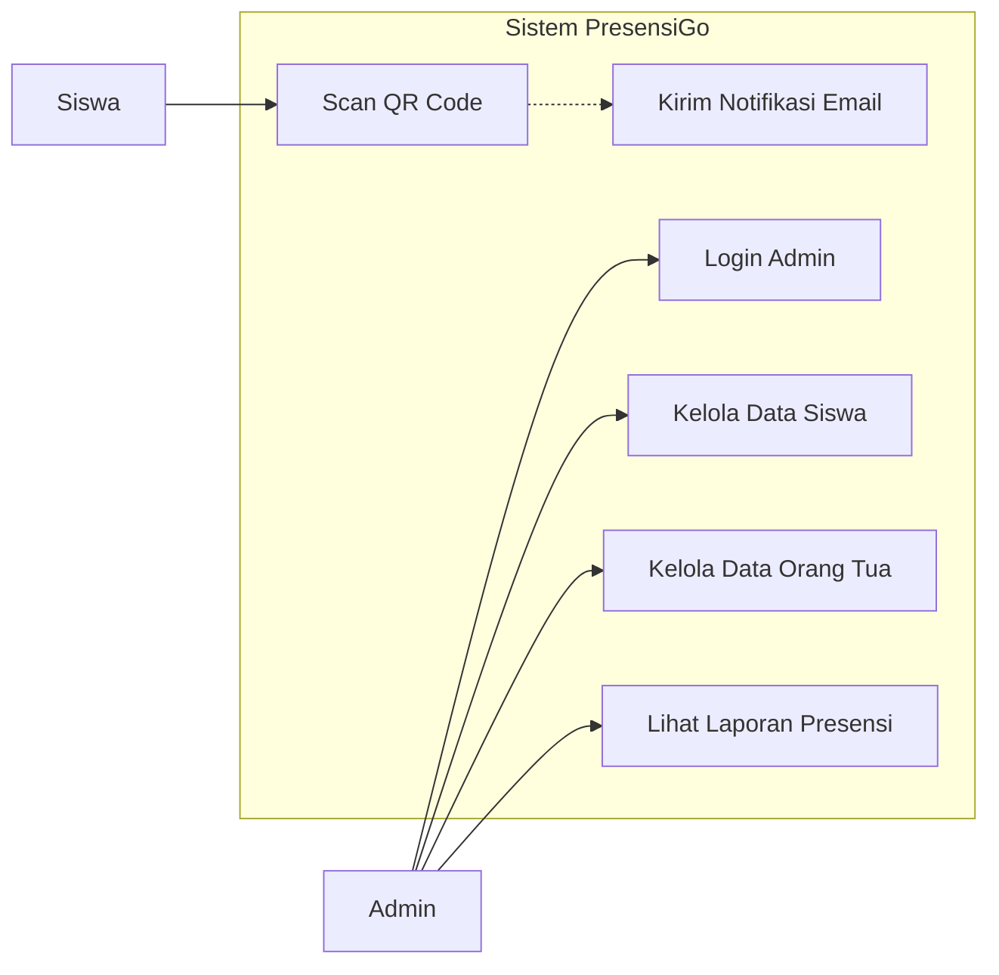
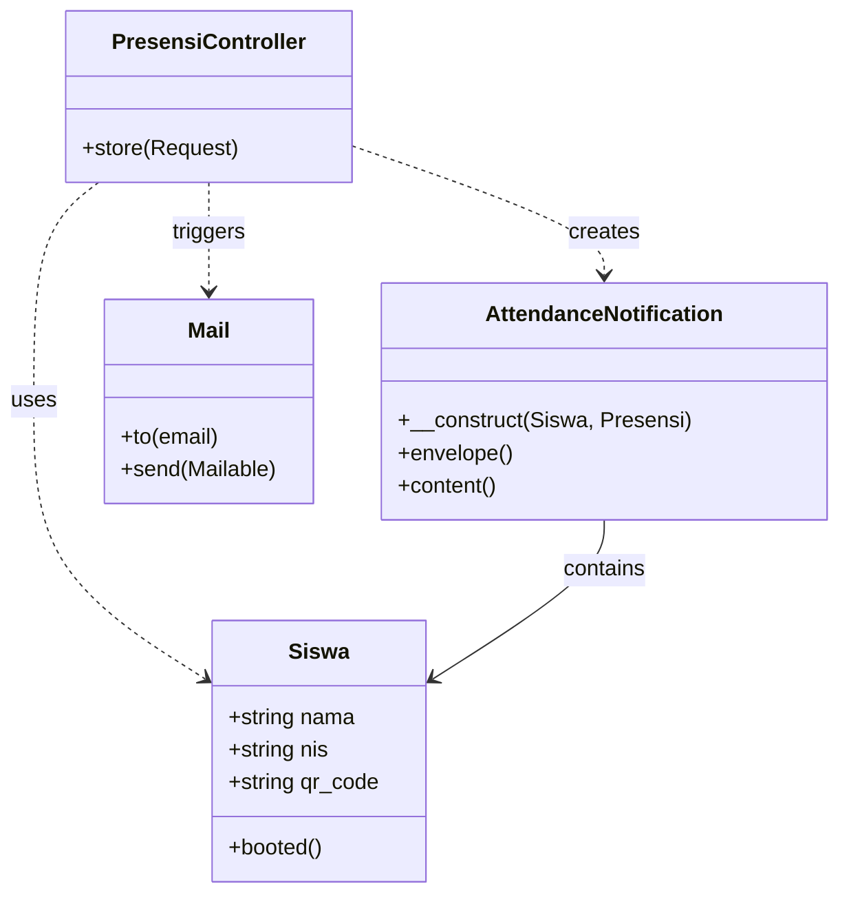
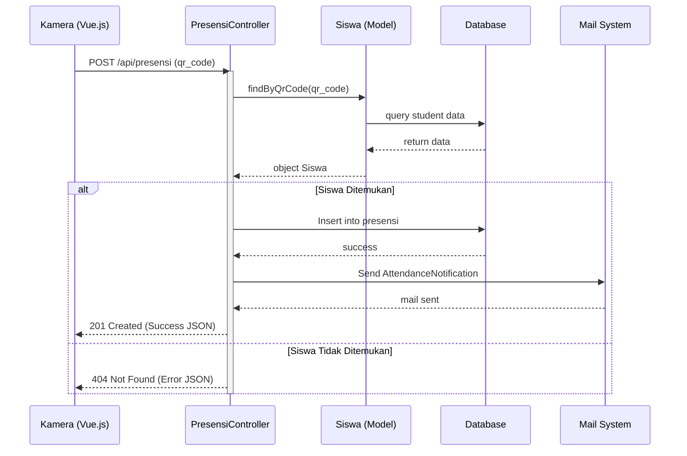

# Unified Modeling Language (UML)

Dokumen ini berisi kumpulan diagram UML untuk sistem PresensiGo.

## 1. Use Case Diagram
Menggambarkan interaksi aktor (Admin & Siswa) dengan sistem.

---

## 2. Class Diagram
Menggambarkan struktur kelas controller, model, dan hubungannya.

---

## 3. Sequence Diagram (Proses Presensi)
Menggambarkan urutan pesan antar objek saat proses scanning berlangsung.

