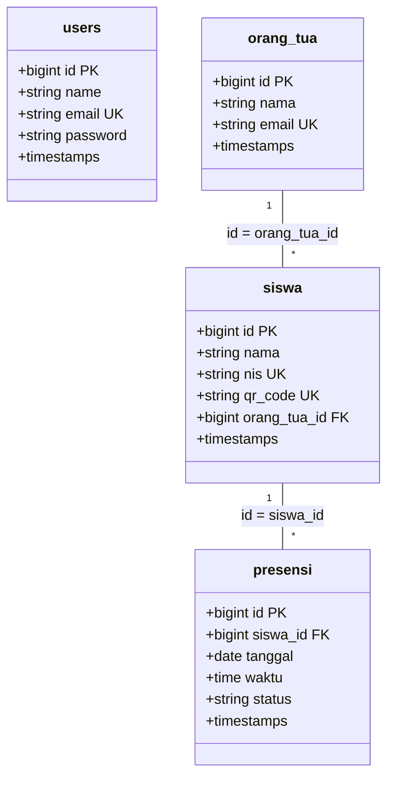

# Logical Record Structure (LRS)

LRS menggambarkan struktur record pada tabel-tabel database beserta relasi kuncinya (Primary & Foreign Key).

## Spesifikasi Tabel:
- **users**: Menyimpan kredensial administrator.
- **orang_tua**: Tabel master data wali murid untuk tujuan pengiriman notifikasi email.
- **siswa**: Tabel master data siswa dengan `qr_code` sebagai pengenal unik saat scanning.
- **presensi**: Tabel transaksi yang mencatat log kehadiran harian.
