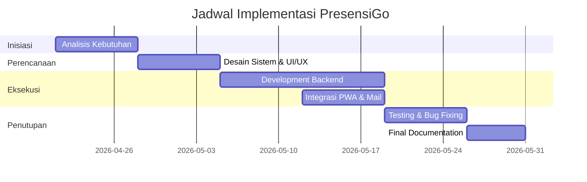

# Jurnal Manajemen Proyek Sistem Informasi
## Tata Kelola Pengembangan Sistem "PresensiGo"

---

### KATA PENGANTAR

Puji syukur kami panjatkan ke hadirat Tuhan Yang Maha Esa atas terselesaikannya dokumen **Manajemen Proyek Sistem Informasi** untuk pengembangan aplikasi **PresensiGo**. Dokumen ini disusun sebagai panduan strategis yang mencakup perencanaan, pengorganisasian, pemantauan, hingga evaluasi risiko proyek.

Efisiensi manajemen proyek menjadi kunci keberhasilan dalam mentransformasi sistem presensi manual menjadi digital yang terintegrasi, akurat, dan transparan.

---

### DAFTAR ISI
1. [**BAB I: PROJECT CHARTER**](#bab-i-project-charter)
    - [1.1. Identitas Proyek](#11-identitas-proyek)
    - [1.2. Deskripsi & Latar Belakang](#12-deskripsi--latar-belakang)
    - [1.3. Tujuan & Faktor Keberhasilan](#13-tujuan--faktor-keberhasilan)
    - [1.4. Teknologi yang Digunakan](#14-teknologi-yang-digunakan)
2. [**BAB II: PERENCANAAN PROYEK**](#bab-ii-perencanaan-proyek)
    - [2.1. Work Breakdown Structure (WBS)](#21-work-breakdown-structure-wbs)
    - [2.2. Jadwal Aktivitas (Gantt Chart)](#22-jadwal-aktivitas-gantt-chart)
    - [2.3. Alokasi Sumber Daya (Tim)](#23-alokasi-sumber-daya-tim)
3. [**BAB III: ANALISIS RISIKO & MANFAAT**](#bab-iii-analisis-risiko--manfaat)
    - [3.1. Manajemen Risiko & Mitigasi](#31-manajemen-risiko--mitigasi)
    - [3.2. Estimasi Manfaat (Benefit Analysis)](#32-estimasi-manfaat-benefit-analysis)
    - [3.3. Batasan & Asumsi](#33-batasan--asumsi)
4. [**BAB IV: PENUTUP**](#bab-iv-penutup)
    - [4.1. Kesimpulan](#41-kesimpulan)

---

## BAB I: PROJECT CHARTER

### 1.1. Identitas Proyek
| Kategori | Keterangan |
|:---|:---|
| **Nama Proyek** | Pemodelan Proses Bisnis Presensi Siswa Menggunakan QR Code dan PWA dengan Notifikasi Real-Time |
| **Sponsor Proyek** | Bibit Sudarsono, M.Kom |
| **Manajer Proyek** | Al Faqi Ramadhan |
| **Unit Organisasi** | Bidang Akademik / Sekolah |
| **Durasi Proyek** | 21 April 2026 – 31 Mei 2026 |

### 1.2. Deskripsi & Latar Belakang
Sistem presensi manual berbasis kertas memiliki kelemahan signifikan seperti pemborosan waktu, risiko kehilangan data, dan manipulasi kehadiran. **PresensiGo** dikembangkan untuk mendigitalkan proses ini menggunakan *Progressive Web App* (PWA) dan *QR Code* untuk efisiensi maksimal.

### 1.3. Tujuan & Faktor Keberhasilan
**Tujuan Proyek**:
1. Membangun platform presensi berbasis PWA yang responsif.
2. Mengotomatisasi pengiriman notifikasi email ke orang tua secara *real-time*.
3. Menyediakan dashboard monitoring kehadiran bagi guru dan admin.

**Faktor Keberhasilan**:
- Kedisiplinan tim dalam mengikuti *timeline* proyek.
- Ketersediaan infrastruktur jaringan yang stabil.
- Dokumentasi teknis yang terstruktur (SQA, Perancangan, Permodelan).

### 1.4. Teknologi yang Digunakan
- **Framework**: Laravel 11 (Backend & API).
- **Frontend**: Blade Engine, Tailwind CSS, Vite.
- **Database**: MySQL (Production) / SQLite (Testing).
- **Environment**: Laragon (Local), Windows Server (Deployment).

---

## BAB II: PERENCANAAN PROYEK

### 2.1. Work Breakdown Structure (WBS)
Proyek dibagi menjadi 4 fase utama:
1. **Fase Inisiasi**: Analisis kebutuhan, penentuan tim, dan penyusunan Project Charter.
2. **Fase Perencanaan**: Desain arsitektur sistem, ERD, UML, dan UI/UX mockup.
3. **Fase Eksekusi**: Pengembangan backend Laravel, integrasi PWA, dan sistem notifikasi.
4. **Fase Penutupan**: Pengujian (QA), dokumentasi akhir, dan evaluasi hasil.

### 2.2. Jadwal Aktivitas (Gantt Chart)

### 2.3. Alokasi Sumber Daya (Tim)
| Nama | Peran | Tanggung Jawab Utama |
|:---|:---|:---|
| **Al Faqi Ramadhan** | Project Manager | Koordinasi tim, monitoring jadwal, dan pelaporan. |
| **Siti Jamilah Safitri** | System Analyst | Analisis kebutuhan bisnis dan pemodelan proses. |
| **Dimas Bayu Nugroho** | Developer | Pengembangan backend, frontend, dan integrasi PWA. |
| **Arvina Nirma Y.T.** | UI/UX Designer | Desain antarmuka aplikasi yang intuitif. |
| **Maria Asna Yati B.** | UI/UX Designer | Mockup dashboard dan alur navigasi. |
| **Shava** | Quality Assurance | Pengujian sistem (Blackbox) dan pelaporan bug. |

---

## BAB III: ANALISIS RISIKO & MANFAAT

### 3.1. Manajemen Risiko & Mitigasi
| Risiko | Dampak | Strategi Mitigasi |
|:---|:---|:---|
| Koneksi internet tidak stabil | Absensi gagal terkirim | Implementasi *Offline Mode* pada PWA. |
| QR Code sulit dipindai | Hambatan proses masuk | Menggunakan library scanner yang mendukung *auto-focus*. |
| Kegagalan Notifikasi Email | Orang tua tidak terinformasi | Menggunakan antrean email (*Queue*) agar bisa dikirim ulang. |

### 3.2. Estimasi Manfaat (Benefit Analysis)
- **Efisiensi Waktu**: Pengurangan waktu absensi hingga **±50%** dibandingkan metode manual.
- **Paperless**: Pengurangan penggunaan kertas hingga **±80%**.
- **Akurasi**: Eliminasi kesalahan pencatatan dan manipulasi kehadiran ("titip absen").
- **Real-time Monitoring**: Kepastian kehadiran siswa diketahui secara instan oleh pihak sekolah dan wali murid.

### 3.3. Batasan & Asumsi
- **Batasan**: Fokus pada sistem presensi, tidak mencakup penilaian akademik atau keuangan sekolah.
- **Asumsi**: Pengguna (siswa/guru) memiliki perangkat mobile yang mendukung pemindaian QR Code.

---

## BAB IV: PENUTUP

### 4.1. Kesimpulan
Manajemen proyek yang terstruktur memastikan bahwa pengembangan **PresensiGo** berjalan sesuai target dan standar kualitas. Dengan kolaborasi tim yang solid dan mitigasi risiko yang tepat, sistem ini siap memberikan nilai tambah bagi digitalisasi ekosistem sekolah.

---
*Terakhir diperbarui: 28 April 2026*
