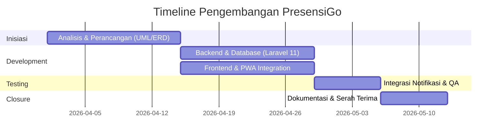
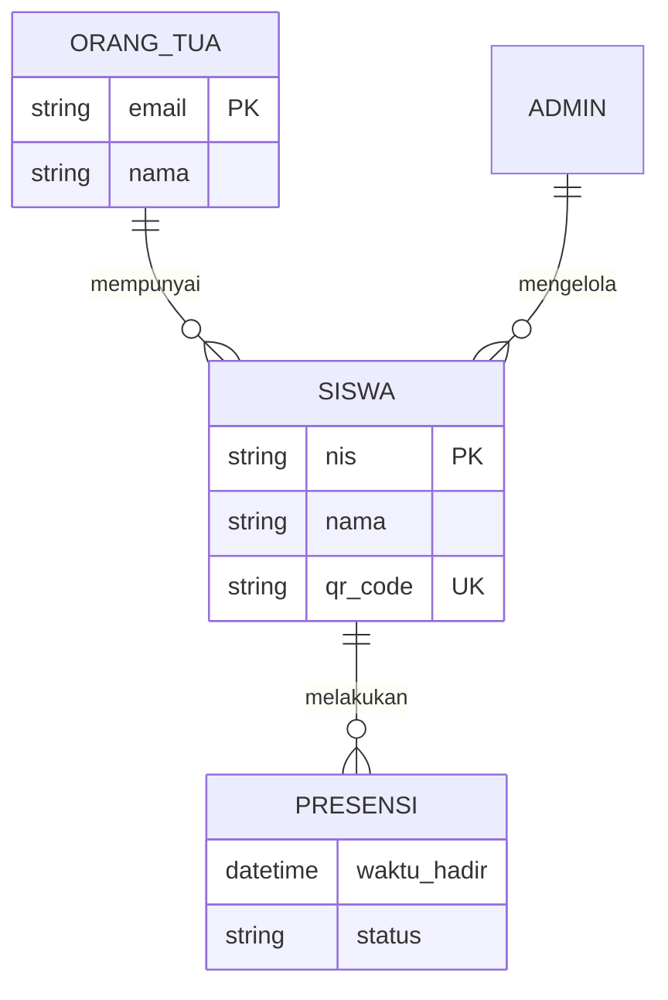

# Jurnal Perancangan Sistem Informasi
## Sistem Presensi Siswa "PresensiGo" Berbasis PWA & Laravel 11

---

### KATA PENGANTAR

Puji syukur kami panjatkan ke hadirat Tuhan Yang Maha Esa atas terselesaikannya dokumen Perancangan Sistem Informasi untuk proyek **PresensiGo**. Dokumen ini disusun sebagai panduan komprehensif yang mencakup aspek manajemen proyek, perancangan teknis, hingga pengujian sistem presensi berbasis *Progressive Web App* (PWA) dan *QR Code*.

Terima kasih kepada seluruh tim yang telah berkontribusi dalam sinkronisasi data dan pengembangan sistem ini agar memenuhi standar kualitas yang diharapkan.

---

### DAFTAR ISI
1. [**BAB I: PROJECT CHARTER**](#bab-i-project-charter)
    - [1.1. Latar Belakang & Metode](#11-latar-belakang--metode-penelitian)
    - [1.2. Deskripsi Produk](#12-deskripsi-produkservice)
    - [1.3. Keuntungan Sistem](#13-keuntungan-yang-diharapkan)
    - [1.4. Timeline Proyek](#14-perencanaan-aktivitas-secara-global)
2. [**BAB II: PROJECT REPORT**](#bab-ii-project-report)
    - [2.1. Analisa Sistem Berjalan](#21-analisa-sistem-berjalan)
    - [2.2. Analisa Kebutuhan](#22-analisa-kebutuhan-sistem)
    - [2.3. Desain Sistem](#23-desain-sistem)
    - [2.4. Implementasi Kode](#24-pembuatan-kode-program)
    - [2.5. Pengujian](#25-pengujian-blackbox-testing)
    - [2.6. Pemeliharaan](#26-pemeliharaan)
3. [**BAB III: PENUTUP**](#bab-iii-penutup)
    - [3.1. Kesimpulan](#31-kesimpulan)
    - [3.2. Saran](#32-saran)

---

## BAB I: PROJECT CHARTER

### 1.1. Latar Belakang & Metode Penelitian
Banyak instansi pendidikan masih menggunakan metode presensi manual yang rawan manipulasi, kehilangan data, dan lambat dalam proses rekapitulasi pelaporan. **PresensiGo** hadir sebagai solusi digital cerdas berbasis *QR Code*.

**Metode Penelitian**: 
Menggunakan model **Waterfall** yang terstruktur:
1.  **Requirement Analysis**: Identifikasi kebutuhan pengguna.
2.  **System Design**: Perancangan database dan UI/UX.
3.  **Implementation**: Penulisan kode program (Laravel 11).
4.  **Integration & Testing**: Pengujian fitur dan fungsionalitas.
5.  **Deployment & Maintenance**: Implementasi dan pemeliharaan.

### 1.2. Deskripsi Produk/Service
**PresensiGo** adalah aplikasi *Progressive Web App* (PWA) yang memungkinkan siswa melakukan absensi secara mandiri.
- **Mekanisme**: Pemindaian QR Code unik per siswa.
- **Automasi**: Pencatatan waktu (*timestamp*) otomatis.
- **Notifikasi**: Pengiriman email *real-time* kepada orang tua saat siswa berhasil melakukan presensi.

### 1.3. Keuntungan Yang Diharapkan
- 🚀 **Efisiensi**: Memangkas waktu absensi kelas hingga 80%.
- 🎯 **Akurasi**: Menghilangkan kesalahan pencatatan manual.
- 🛡️ **Transparansi**: Orang tua mendapatkan notifikasi kehadiran secara instan.
- 📱 **Aksesibilitas**: PWA memungkinkan instalasi tanpa melalui toko aplikasi (Play Store/App Store).

### 1.4. Perencanaan Aktivitas Secara Global
Proyek direncanakan selesai dalam waktu 6 minggu dengan alokasi sebagai berikut:

---

## BAB II: PROJECT REPORT

### 2.1. Analisa Sistem Berjalan
Sistem saat ini masih bergantung pada media fisik (buku absen).
- **Alur**: Guru memanggil nama siswa -> Menandai buku -> Rekapitulasi manual di akhir bulan.
- **Kelemahan**: Risiko data rusak/hilang, manipulasi titip absen, dan orang tua tidak tahu apakah anak benar-benar sampai di sekolah.

### 2.2. Analisa Kebutuhan Sistem

**A. Kebutuhan Fungsional**
| ID | Fitur | Deskripsi |
|:---|:---|:---|
| F-01 | Auth System | Login Admin untuk manajemen data. |
| F-02 | Data Management | CRUD Siswa, Orang Tua, dan Kelas. |
| F-03 | QR Generator | Pembuatan QR Code unik otomatis untuk setiap siswa. |
| F-04 | Presence Engine | Scanner QR Code berbasis browser. |
| F-05 | Real-time Mail | Pengiriman notifikasi kehadiran ke email orang tua. |

**B. Kebutuhan Non-Fungsional**
- **Security**: Protokol HTTPS dan enkripsi password.
- **Performance**: Response time scanner < 3 detik.
- **Compatibility**: Berjalan di Chrome, Edge, dan Safari.

### 2.3. Desain Sistem

#### A. Desain Basis Data (ERD)

#### B. Struktur Navigasi
1.  **Guest/Siswa**: 
    - `GET /` -> Halaman utama/Informasi.
    - `GET /scan` -> Interface kamera scanner.
2.  **Admin**:
    - `GET /login` -> Autentikasi.
    - `GET /dashboard` -> Statistik kehadiran.
    - `GET /siswa` -> Manajemen data siswa.

### 2.4. Pembuatan Kode Program
Sistem menggunakan **Laravel 11** dengan arsitektur modern:
- **Model Observer**: Menghandle otomatisasi *QR Code generation* saat data siswa baru disimpan.
- **Eloquent Relationships**: Menghubungkan siswa dengan orang tua secara efisien.
- **Vite Asset Bundling**: Memastikan performa frontend yang cepat dan ringan.

### 2.5. Pengujian (Blackbox Testing)
Pengujian otomatis dilakukan menggunakan **PHPUnit**:
| Modul | Skenario Uji | Status |
|:---|:---|:---|
| Authentication | Login valid & invalid credentials | **PASSED** |
| QR Scanner | Validasi token, duplikasi scan, & error handling | **PASSED** |
| Mail System | Verifikasi antrian email notifikasi | **PASSED** |
| PWA Assets | Keberadaan `manifest.json` & `sw.js` | **PASSED** |

### 2.6. Pemeliharaan
Strategi pemeliharaan jangka panjang meliputi:
- **Log Monitoring**: Menggunakan Laravel Logs untuk melacak error scanner.
- **Data Integrity**: Backup database mingguan.
- **Optimization**: *Pruning* data presensi lama secara berkala.

---

## BAB III: PENUTUP

### 3.1. Kesimpulan
**PresensiGo** berhasil mentransformasi sistem absensi manual menjadi ekosistem digital yang efisien, transparan, dan akurat. Penggunaan Laravel 11 sebagai tulang punggung sistem menjamin skalabilitas, sementara teknologi PWA memberikan pengalaman pengguna yang superior tanpa batasan platform.

### 3.2. Saran
1.  **Multi-channel Notification**: Integrasi dengan API WhatsApp sebagai alternatif email.
2.  **Advanced Analytics**: Penambahan fitur grafik absensi bulanan untuk memudahkan evaluasi guru.
3.  **Export Features**: Fitur cetak laporan rekapitulasi ke format PDF/Excel dalam satu klik.