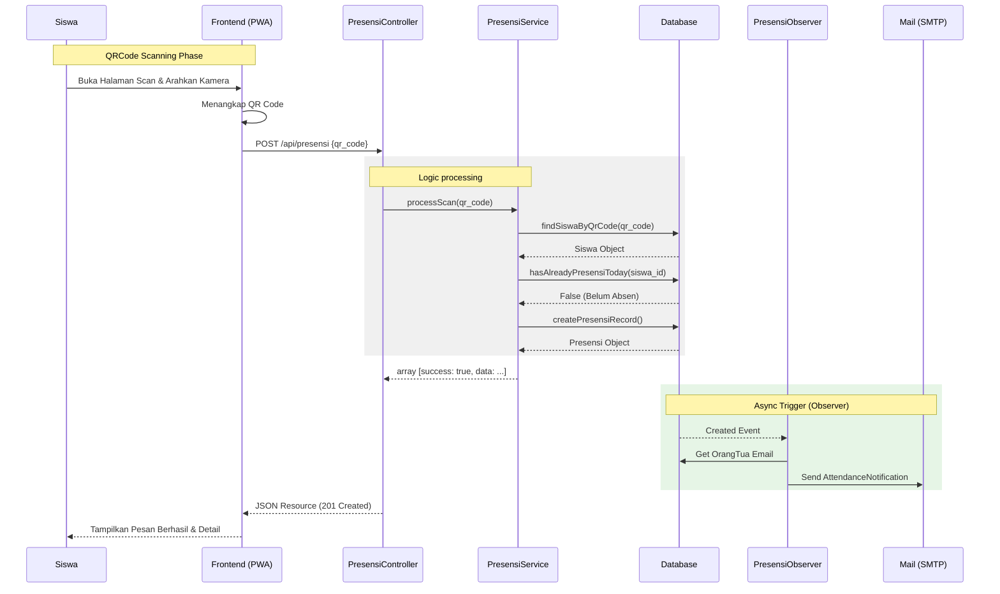

# Sequence Diagram

## Alur Interaksi Presensi Siswa

### Log Interaksi Pesan (Versi Tekstual)

1.  **Frontend (UI)** -> **Controller**: `POST /api/presensi` membawa `qr_code`.
2.  **Controller** -> **Service**: `processScan(qr_code)` memulai validasi.
3.  **Service** -> **Database**: Query `Siswa` berdasarkan QR.
4.  **Service** -> **Database**: Cek keberadaan `Presensi` untuk `siswa_id` pada tanggal hari ini.
5.  **Service** -> **Database**: `Insert` record baru ke tabel `presensi`.
6.  **Database** -> **Observer**: Event `created` terpanggil saat insert berhasil.
7.  **Observer** -> **Mail**: Membentuk objek `AttendanceNotification` dan mengirim via SMTP.
8.  **Service** -> **Controller**: Mengembalikan status `success`.
9.  **Controller** -> **Frontend (UI)**: Response JSON 201 ditampilkan sebagai alert sukses di layar.
