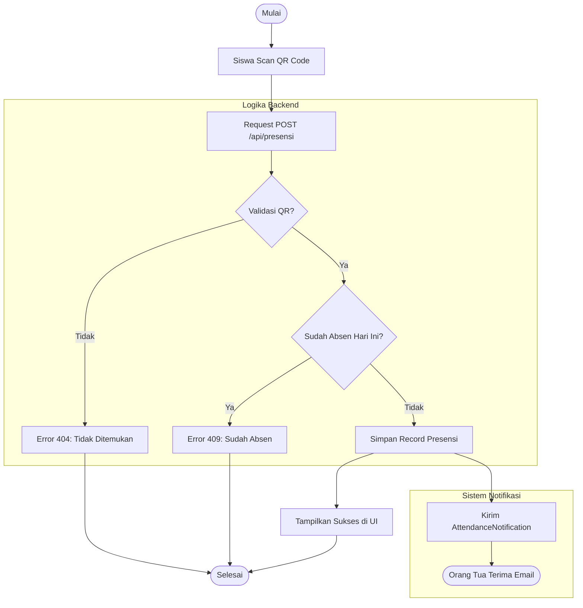

# Permodelan Sistem Informasi PresensiGo

## 1. Pendahuluan
Dokumen ini merangkum seluruh pemodelan proses bisnis dan arsitektur teknis dari aplikasi **PresensiGo**. Fokus sistem adalah automasi pencatatan kehadiran menggunakan QR Code dengan integrasi notifikasi email ke orang tua.

## 2. Alur Proses Bisnis (Flowchart)

## 3. Komponen Permodelan
Sistem ini dimodelkan menggunakan standar UML yang terdiri dari:

1.  **[Activity Diagram](Diagram/ActivityDiagram.md)**: Menggambarkan alur kerja detail dari sisi pengguna dan sistem.
2.  **[Class Diagram](Diagram/ClassDiagram.md)**: Peta struktur database, model Eloquent, dan relasi antar entitas.
3.  **[Package Diagram](Diagram/PackageDiagram.md)**: Visualisasi layer arsitektur (Frontend, Controller, Model).
4.  **[Sequence Diagram](Diagram/SequenceDiagram.md)**: Detail interaksi pesan antar objek dalam satu siklus presensi.
5.  **[Use Case Diagram](Diagram/UseCaseDiagram.md)**: Gambaran interaksi aktor (Siswa, Admin, Orang Tua) terhadap fitur sistem.

## 4. Keselarasan dengan Projek
Pemodelan ini sepenuhnya mencerminkan implementasi pada kode sumber:
- **Unified Controller**: Menggunakan `PresensiController` untuk menangani seluruh alur data dan logika bisnis secara efisien.
- **Model Events**: Menggunakan hook `booted()` pada model `Siswa` untuk otomatisasi pembuatan QR Code unik.
- **Relasi Database**: Menggunakan relasi `BelongsTo` antara Siswa dan Orang Tua, serta Siswa dan Presensi.
- **PWA Ready**: Mendukung operasional mobile-first dengan antarmuka scanner yang responsif.

---
*Terakhir diperbarui: 22 April 2026*