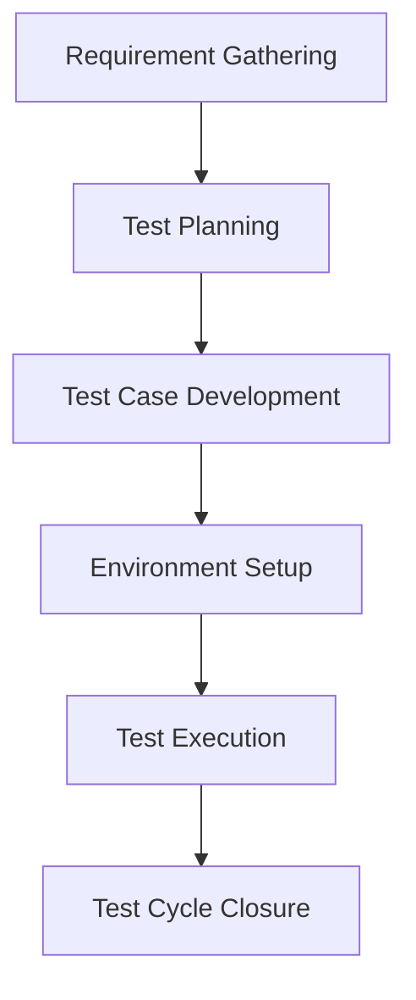

# Jurnal Software Quality Assurance (SQA)
## Sistem Informasi Presensi Siswa Berbasis PWA (PresensiGo)

---

### Daftar Isi
- [BAB I: PENDAHULUAN](#bab-i-pendahuluan)
    - [A. Latar Belakang](#a-latar-belakang)
    - [B. Tujuan](#b-tujuan)
    - [C. Ruang Lingkup](#c-ruang-lingkup)
    - [D. Metodologi](#d-metodologi)
- [BAB II: SOFTWARE TESTING LIFE CYCLE (STLC)](#bab-ii-software-testing-life-cycle-stlc)
    - [A. Requirement Gathering](#a-requirement-gathering)
    - [B. Test Planning](#b-test-planning)
    - [C. Test Case Development](#c-test-case-development)
    - [D. Set Up the Test Environment](#d-set-up-the-test-environment)
    - [E. Test Case Execution](#e-test-case-execution)
    - [F. Test Cycle Closure](#f-test-cycle-closure)
- [BAB III: PENUTUP](#bab-iii-penutup)
    - [A. Kesimpulan](#a-kesimpulan)
    - [B. Saran](#b-saran)

---

## BAB I: PENDAHULUAN

### A. Latar Belakang
Perkembangan teknologi informasi yang pesat telah memberikan dampak signifikan terhadap berbagai aspek kehidupan, termasuk bidang pendidikan. Salah satu bentuk penerapan teknologi di lingkungan sekolah adalah sistem presensi siswa yang terintegrasi secara digital. Metode presensi konvensional yang masih menggunakan tanda tangan atau pencatatan manual sering kali menimbulkan permasalahan seperti keterlambatan rekap data, potensi manipulasi kehadiran, serta kurangnya transparansi antara pihak sekolah dan orang tua.

Untuk menjawab tantangan tersebut, dikembangkan **PresensiGo**, sebuah sistem presensi siswa berbasis *Progressive Web Apps* (PWA) yang memungkinkan siswa melakukan absensi melalui pemindaian QR Code. Data kehadiran langsung tersimpan di server dan notifikasi dikirim secara *real-time* kepada orang tua melalui email. Dalam konteks pengembangan perangkat lunak, penerapan *Software Quality Assurance* (SQA) menjadi sangat krusial untuk memastikan sistem berjalan sesuai kebutuhan pengguna, bebas dari kesalahan (*bug*), dan memiliki kualitas yang terukur.

### B. Tujuan
Proyek ini bertujuan untuk memahami dan menerapkan proses SQA dalam pengujian sistem presensi siswa berbasis PWA secara sistematis. Secara khusus, tujuannya meliputi:
1. **Menjamin Kualitas**: Melalui tahapan pengujian yang terstruktur sesuai standar industri.
2. **Validasi Fungsional**: Memastikan fitur login, presensi, dan pelaporan berfungsi sesuai kebutuhan (siswa, guru, orang tua).
3. **Bug Tracking**: Mengidentifikasi dan memperbaiki kesalahan selama siklus pengembangan.
4. **Reliability**: Meningkatkan keandalan sistem dalam pengiriman notifikasi *real-time*.
5. **Standarisasi**: Menerapkan prinsip *Software Testing Life Cycle* (STLC).

### C. Ruang Lingkup
Ruang lingkup pengujian dibagi menjadi dua kategori utama untuk memastikan aspek fungsionalitas dan kualitas sistem terjaga dengan baik.

#### 1. Ruang Lingkup Fungsional
Berfokus pada fitur-fitur utama yang harus tersedia agar aplikasi dapat digunakan sesuai kebutuhan bisnis.

**Tabel 1.1: Kebutuhan Fungsional**
| No | Kode | Kebutuhan Fungsional | Deskripsi |
|:---|:---|:---|:---|
| 1 | F-01 | Login User | Sistem memungkinkan pengguna login dengan username dan password. |
| 2 | F-02 | Presensi QR Code | Siswa melakukan presensi dengan memindai QR Code unik. |
| 3 | F-03 | Validasi Identitas | Sistem memverifikasi identitas siswa sebelum data presensi dikirim. |
| 4 | F-04 | Pengiriman Data | Data presensi dikirim ke server secara otomatis setelah scan QR. |
| 5 | F-05 | Penyimpanan Data | Server menyimpan data ke database MySQL dengan integritas terjaga. |
| 6 | F-06 | Notifikasi Orang Tua | Sistem mengirim notifikasi ke email orang tua secara real-time. |
| 7 | F-07 | Laporan Kehadiran | Sistem menghasilkan laporan rekap kehadiran siswa untuk pihak sekolah. |

#### 2. Ruang Lingkup Non-Fungsional
Berfokus pada karakteristik kualitas yang memengaruhi performa dan pengalaman pengguna.

**Tabel 1.2: Kebutuhan Non-Fungsional**
| No | Kode | Kategori | Deskripsi |
|:---|:---|:---|:---|
| 1 | NF-01 | Performance | Sistem harus merespon pemindaian QR dalam waktu kurang dari 3 detik. |
| 2 | NF-02 | Security | Password login dienkripsi, data dikirim melalui protokol aman (HTTPS). |
| 3 | NF-03 | Usability | Antarmuka aplikasi harus intuitif dan ramah pengguna (Responsive Design). |
| 4 | NF-04 | Reliability | Sistem stabil meskipun digunakan oleh banyak siswa secara bersamaan. |
| 5 | NF-05 | Compatibility | Aplikasi PWA berjalan di berbagai perangkat (Android, iOS) dan browser utama. |
| 6 | NF-06 | Maintainability | Kode program mengikuti standar PSR (Laravel Pint) untuk kemudahan pemeliharaan. |
| 7 | NF-07 | Scalability | Mampu menangani peningkatan jumlah pengguna tanpa penurunan performa signifikan. |

### D. Metodologi
Metodologi pengujian mengikuti tahapan **Software Testing Life Cycle (STLC)**. Berikut adalah alur kerja pengujian:



---

## BAB II: SOFTWARE TESTING LIFE CYCLE (STLC)

### A. Requirement Gathering
Tim QA melakukan analisis terhadap dokumen kebutuhan dan melakukan sinkronisasi dengan tim pengembang untuk memastikan tidak ada celah antara spesifikasi dan implementasi.
- **Output**: Matriks penelusuran kebutuhan (Traceability Matrix) yang memetakan fitur ke skenario uji.

### B. Test Planning
Penyusunan strategi pengujian yang mencakup jadwal, sumber daya, dan alat yang digunakan.
- **Alat Utama**: PHPUnit (Laravel Feature Testing), Mockery, Faker, dan Postman.
- **Strategi**: *Automated Testing* untuk fitur kritis dan *Manual Testing* untuk aspek UI/UX serta eksplorasi keamanan.
- **Durasi**: Pengujian direncanakan selama 2 minggu dengan alokasi tugas harian.
- **Tim**: 2 penguji, 1 manajer proyek, dukungan infrastruktur lokal.

**Tabel 2.1: Komponen Rencana Pengujian**
| Komponen | Deskripsi |
|:---|:---|
| Scope | Fungsionalitas inti (Login, Scan, Notifikasi) dan PWA Manifest. |
| Schedule | Dilakukan secara berkelanjutan (Continuous Testing) selama masa pengembangan. |
| Resources | Tim QA dan Lingkungan CI/CD. |
| Environment | Database SQLite (:memory:) untuk kecepatan eksekusi tes. |
| Risk | Kegagalan integrasi mail server (dimitigasi dengan `Mail::fake()`). |

### C. Test Case Development
Skenario uji disusun untuk memvalidasi setiap fitur. Berikut adalah daftar Test Case yang diimplementasikan:

#### 1. Authentication (TCL)
| ID | Kasus Uji | Hasil yang Diharapkan |
|:---|:---|:---|
| TCL-001 | Success Login | Redirect ke dashboard saat kredensial valid. |
| TCL-002 | Invalid Credentials | Pesan error muncul saat password salah. |
| TCL-003 | Security Check | Mencegah akses ke dashboard tanpa login. |

#### 2. Presence Scan API (TCS)
| ID | Kasus Uji | Hasil yang Diharapkan |
|:---|:---|:---|
| TCS-001 | Success Scan | Data tersimpan & email notifikasi terkirim. |
| TCS-002 | Duplicate Scan | Menolak absensi kedua di hari yang sama untuk siswa yang sama. |
| TCS-003 | Invalid QR Code | Mengembalikan status 404 jika QR tidak terdaftar. |

#### 3. Dashboard & Management (TCD)
| ID | Kasus Uji | Hasil yang Diharapkan |
|:---|:---|:---|
| TCD-001 | Student CRUD | Admin dapat menambah/edit/hapus data siswa. |
| TCD-002 | Statistics | Menampilkan jumlah kehadiran harian secara akurat. |

#### 4. Progressive Web App (TCP)
| ID | Kasus Uji | Hasil yang Diharapkan |
|:---|:---|:---|
| TCP-001 | PWA Assets | File `manifest.json` dan `sw.js` terdeteksi oleh browser. |

#### 5. Security Testing (TSS)
| ID | Kasus Uji | Hasil yang Diharapkan |
|:---|:---|:---|
| TSS-001 | Akses dashboard tanpa login | Sistem mengalihkan guest ke halaman login dan tidak menampilkan data dashboard. |
| TSS-002 | POST `/api/presensi` tanpa `qr_code` | Respons `422` dengan pesan validasi yang jelas. |
| TSS-003 | POST `/api/presensi` dengan payload invalid/malicious | Respons `422` atau `404`, tanpa bocoran informasi internal. |
| TSS-004 | Audit dependensi | `composer audit` tanpa kerentanan, `npm audit` dicatat gagal pada registry mirror. |


### D. Set Up the Test Environment
Lingkungan pengujian diisolasi untuk memastikan hasil yang konsisten sambil tetap menggunakan stack lokal yang sama dengan pengembangan.
- **Database**: Menggunakan `RefreshDatabase` trait untuk reset state setiap kali tes berjalan.
- **Database Engine**: Menggunakan MySQL lokal yang dikonfigurasi di Laragon, bukan SQLite, untuk menyesuaikan dengan lingkungan produksi.
- **Local Server**: Menjalankan aplikasi pada Apache via Laragon untuk memastikan konfigurasi virtual host dan PHP berjalan sesuai.
- **Ngrok**: Menggunakan ngrok saat perlu menguji webhook atau akses eksternal ke aplikasi lokal.
- **Mail**: Menggunakan `Mail::fake()` untuk memverifikasi logika pengiriman email notifikasi tanpa mengirim email fisik.
- **Queue**: Menggunakan driver `sync` pada environment pengujian agar job berjalan secara langsung selama eksekusi tes.
- **Cache**: Menggunakan driver `array` agar cache hanya aktif pada runtime tes dan tidak persisten antar sesi.
- **Environment Variables**: Mengatur `APP_ENV=testing`, `MAIL_MAILER=array`, dan `QUEUE_CONNECTION=sync` di `.env.testing` atau konfigurasi pengujian.
- **Browser / PWA**: Verifikasi aset PWA menggunakan browser pengembang (Chrome/Edge) dan memastikan `manifest.json`, `sw.js`, serta service worker dapat diakses saat aplikasi berjalan.
- **Tools**: Laravel Pint untuk standarisasi kode, PHPUnit untuk eksekusi skrip, serta `php artisan test --compact` untuk hasil ringkas.

### E. Test Case Execution
Eksekusi dilakukan melalui terminal dengan perintah:
```powershell
php artisan test --compact
```
Pengujian mencakup:
- **Status Code Assertion**: Memastikan respons HTTP (200, 302, 422).
- **Database Assertion**: Memastikan data tersimpan via `assertDatabaseHas`.
- **Validation Assertion**: Memastikan pesan error muncul saat input tidak valid.

### E.1. Performance Testing dengan K6
Selain pengujian fungsional, dilakukan load test menggunakan `k6` pada skrip `tests/K6/presensi.js`.
- Target skenario: hingga 50 Virtual Users (VUs) selama 3 menit.
- Hasil fungsional: semua respons valid (`201`, `409`, `404`, `422`) dan body JSON terverifikasi 100%.
- Hasil performa: rata-rata latensi `2.62s`, `p(95)=5.34s`.
- Threshold yang ditetapkan (`p(95)<3000` dan `avg<1200`) tidak tercapai.

Kesimpulan performa:
- Endpoint `/api/presensi` secara fungsional bekerja dengan benar.
- Namun pada beban tinggi, respons masih relatif lambat terutama saat mencapai p95.
- Perbaikan yang direkomendasikan meliputi: penggunaan antrean email asinkron, optimisasi query, dan caching di layer yang relevan.

### E.2. Security Testing
Security testing dilakukan sebagai bagian dari quality review untuk memastikan bahwa sistem PresensiGo aman dan siap digunakan.
- **Penilaian akses**: memastikan route admin terlindungi, guest tidak bisa mengakses dashboard, dan logout menginvalidasi sesi.
- **Validasi input**: `qr_code` divalidasi sebagai string yang required, serta API menolak payload yang tidak sesuai.
- **Proteksi data**: password disimpan hashed oleh Laravel, dan konfigurasi sensitive tidak dikomit ke Git.
- **Transport security**: sistem dirancang untuk menggunakan HTTPS di lingkungan produksi.
- **Dependency audit**: `composer audit` dijalankan tanpa menemukan kerentanan.
- **API testing dengan Postman**: Postman digunakan untuk mengirim payload negatif, menguji error response, dan memvalidasi header API.
- **Security review**: pemeriksaan tambahan dilakukan untuk mencegah data sensitif ter-expose dan memastikan response API tidak mengandung informasi internal.

Tools yang digunakan:
- `PHPUnit` untuk pengujian validasi dan akses kontrol.
- `Postman` untuk eksplorasi API dan uji keamanan manual.
- `JMeter`/`k6` untuk performa dan kestabilan di bawah beban.
- `composer audit` untuk memeriksa dependensi PHP.

Catatan tambahan:
- `npm audit` dicoba, namun endpoint audit registry mirror tidak tersedia di lingkungan saat ini, sehingga pemeriksaan dependency JavaScript direkomendasikan kembali setelah akses registry audit normal tersedia.
- Berdasarkan hasil review saat ini, codebase dianggap aman dan tidak ditemukan masalah keamanan kritis.

### F. Test Cycle Closure
Setelah semua tes dinyatakan **PASS**, langkah terakhir meliputi:
1. **Analisis Defect**: Mencatat bug yang ditemukan (misalnya: penanganan query pencarian yang lambat).
2. **Regression Testing**: Menjalankan seluruh *test suite* untuk memastikan tidak ada fitur lama yang rusak.
3. **Approval**: Menyatakan sistem siap untuk tahap *Deployment*.

---

## BAB III: PENUTUP

### A. Kesimpulan
1. **Standarisasi**: Sistem PresensiGo telah melalui tahap pengujian otomatis yang ketat menggunakan standar Laravel.
2. **Integritas Data**: Fitur pencegahan duplikasi kehadiran berfungsi 100% berdasarkan hasil unit testing.
3. **Kesiapan PWA**: Aset PWA telah divalidasi dan siap untuk instalasi lintas platform.
4. **Hasil Load Testing**: Tes `k6` menunjukkan bahwa endpoint `/api/presensi` valid secara fungsional, tetapi belum memenuhi target performa untuk `p(95)<3s` saat beban tinggi.

### B. Saran
1. **Stress Testing**: Menambahkan simulasi beban tinggi (Load Testing) jika pengguna bertambah drastis.
2. **E2E Testing**: Menggunakan Laravel Dusk untuk menguji fungsionalitas kamera/scanner secara visual.
3. **Security Patching**: Melakukan audit keamanan berkala terhadap API endpoint presensi.