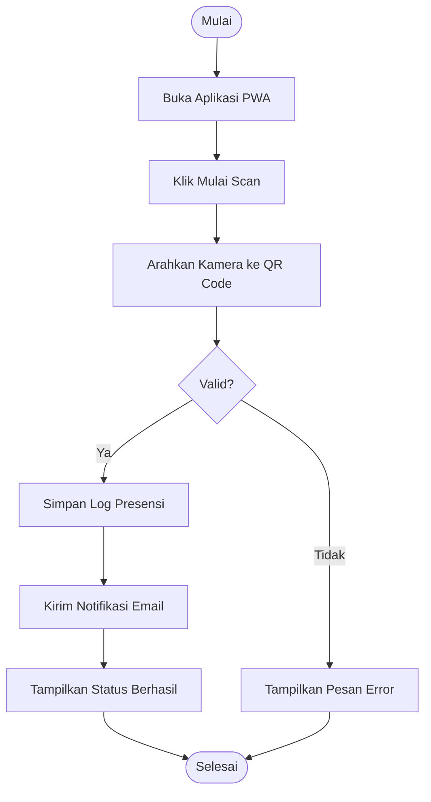

# Jurnal Pemrograman Web (Web Programming)
## Implementasi Sistem Informasi Presensi "PresensiGo" dengan Laravel 11

---

### KATA PENGANTAR

Puji syukur kami panjatkan ke hadirat Tuhan Yang Maha Esa atas terselesaikannya dokumen **Pemrograman Web** untuk proyek **PresensiGo**. Dokumen ini merangkum seluruh aspek teknis pengembangan aplikasi, mulai dari landasan teori, analisis sistem berjalan, hingga rancangan sistem usulan berbasis teknologi web modern.

Penggunaan Laravel 11 sebagai framework utama bertujuan untuk menjamin keamanan, kecepatan pengembangan, serta kemudahan dalam integrasi berbagai layanan seperti PWA dan sistem notifikasi email.

---

### DAFTAR ISI
1. [**BAB I: PENDAHULUAN**](#bab-i-pendahuluan)
    - [1.1. Latar Belakang](#11-latar-belakang-masalah)
    - [1.2. Maksud dan Tujuan](#12-maksud-dan-tujuan)
    - [1.3. Metode Penelitian](#13-metode-penelitian)
2. [**BAB II: LANDASAN TEORI**](#bab-ii-landasan-teori)
    - [2.1. Konsep Dasar Sistem](#21-konsep-dasar-sistem)
    - [2.2. Teori Pendukung (Laravel, PWA, Tailwind)](#22-teori-pendukung-program)
3. [**BAB III: ANALISA SISTEM BERJALAN**](#bab-iii-analisa-sistem-berjalan)
    - [3.1. Prosedur Sistem Berjalan](#32-prosedur-sistem-berjalan)
    - [3.2. Permasalahan Pokok & Pemecahan Masalah](#34-permasalahan-pokok)
4. [**BAB IV: RANCANGAN SISTEM & IMPLEMENTASI**](#bab-iv-rancangan-sistem-dan-implementasi)
    - [4.1. Skenario Activity Diagram](#411-activity-diagram-proses-presensi)
    - [4.2. Spesifikasi Basis Data](#42-rancangan-basis-data)
    - [4.3. Implementasi Kode](#44-implementasi-sistem)
5. [**BAB V: PENUTUP**](#bab-v-penutup)
    - [5.1. Kesimpulan & Saran](#51-kesimpulan)

---

## BAB I: PENDAHULUAN

### 1.1. Latar Belakang Masalah
Proses pencatatan kehadiran siswa di banyak instansi pendidikan masih sering dilakukan secara konvensional menggunakan kertas (absensi manual). Metode ini memiliki kelemahan dalam hal efisiensi waktu, risiko kerusakan data, serta lambatnya penyampaian informasi kepada orang tua siswa. **PresensiGo** hadir sebagai solusi digital berbasis web untuk otomasi proses tersebut.

### 1.2. Maksud dan Tujuan
*   **Efisiensi**: Mengimplementasikan QR Code untuk mempercepat absensi.
*   **Aksesibilitas**: Membangun aplikasi PWA yang dapat diinstal di berbagai perangkat.
*   **Transparansi**: Mengotomatisasi notifikasi email kepada orang tua sebagai bukti kehadiran anak di sekolah.

### 1.3. Metode Penelitian
Menggunakan model **Waterfall** yang meliputi:
1.  **Analisa Kebutuhan**: Identifikasi data master dan fitur inti.
2.  **Desain**: Perancangan struktur database dan antarmuka.
3.  **Pengodean**: Implementasi menggunakan Laravel 11 & PHP 8.2.
4.  **Pengujian**: Validasi fungsionalitas menggunakan PHPUnit.

---

## BAB II: LANDASAN TEORI

### 2.1. Konsep Dasar Sistem
Sistem informasi presensi adalah integrasi antara perangkat lunak, database, dan pengguna untuk mengelola data kehadiran secara terstruktur.

### 2.2. Teori Pendukung Program
- **Laravel 11**: Framework PHP dengan pola MVC yang memberikan kemudahan dalam manajemen routing, database migration, dan authentication.
- **PWA (Progressive Web App)**: Teknologi yang memungkinkan aplikasi web diakses secara offline dan memiliki ikon di layar utama (Homescreen).
- **Tailwind CSS**: Framework CSS utility-first untuk membangun antarmuka yang responsif dan modern.

---

## BAB III: ANALISA SISTEM BERJALAN

### 3.1. Prosedur Sistem Berjalan
1. Guru membawa buku absen fisik ke kelas.
2. Guru memanggil nama siswa satu per satu.
3. Guru memberikan tanda centang pada buku.
4. Data direkap secara manual di akhir bulan untuk laporan wali kelas.

### 3.2. Permasalahan Pokok & Pemecahan Masalah
**Masalah**: Rekapitulasi lambat, rawan kecurangan titip absen, dan orang tua tidak terinformasi secara instan.
**Solusi**: Membangun aplikasi **PresensiGo**. Siswa melakukan scan mandiri, data tersimpan otomatis di database cloud, dan sistem langsung mengirimkan notifikasi ke email orang tua.

---

## BAB IV: RANCANGAN SISTEM DAN IMPLEMENTASI

### 4.1. Rancangan Sistem Usulan

#### 4.1.1. Activity Diagram (Proses Presensi)

### 4.2. Rancangan Basis Data

#### 4.2.1. Spesifikasi Tabel Utama
| Tabel | Deskripsi Kolom Utama |
|:---|:---|
| `users` | name, email, password (Admin Access) |
| `orang_tua` | nama, email (Recipient for Notifications) |
| `siswa` | nama, nis, qr_code, orang_tua_id (Primary Data) |
| `presensi` | siswa_id, tanggal, waktu, status (Log Transaksi) |

### 4.3. Implementasi Sistem
Aplikasi diimplementasikan menggunakan **Laravel 11**. Logika utama berada pada `PresensiController` yang menangani validasi *unique QR*, pengecekan duplikasi harian, dan pemicu pengiriman email melalui *Mail Queue* Laravel untuk performa maksimal.

---

## BAB IV: PENUTUP

### 5.1. Kesimpulan
Sistem PresensiGo berhasil mendigitalisasi proses absensi yang manual menjadi otomatis menggunakan teknologi QR Code. Integrasi PWA memungkinkan penggunaan aplikasi layaknya aplikasi native tanpa beban instalasi yang rumit.

### 5.2. Saran
- **Geofencing**: Menambahkan validasi koordinat GPS agar scan hanya bisa dilakukan di area sekolah.
- **WhatsApp Integration**: Menambahkan alternatif notifikasi melalui API WhatsApp.

---

### DAFTAR PUSTAKA
*   Laravel Framework Documentation (https://laravel.com/docs/11.x)
*   Tailwind CSS Guide (https://tailwindcss.com/docs)
*   Progressive Web Apps Overview (https://web.dev/progressive-web-apps/)
